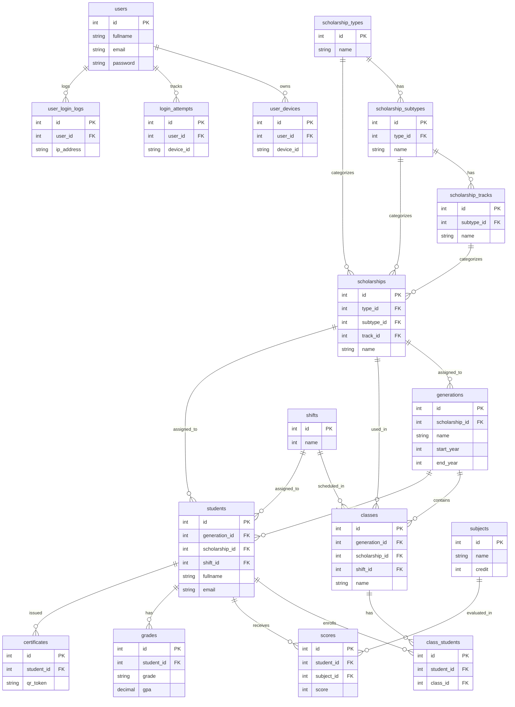

# AlumniNet Backend
This backend ctr management control shcolarship students.

## How to Get Started
Clone the repository and install dependencies

```bash
https://github.com/Sourcedevkh/alumniNet-api.git
cd alumniNet-api
npm install
```

Run the setup script to configure your environment variables, initialize the database, and populate it with sample data:

```bash
npm run setup
```

This script will:

- Create a ```.env``` the Backend 
- Connection database ```MySQL``` 
- Expires jwt

## Architecture ERD




## Data Flow Diagram (DFD) 

This link DFD AlumniNet handler by teams
```bash
https://www.figma.com/board/rfimfi3raLKQMN0NTBRzXv/DFD?node-id=0-1&p=f&t=TMOd8c71EM0zIMaP-0
```

## Entity-Relationship Diagram (ERD)

Link ERD AlumniNet 
```bash
https://app.diagrams.net/#G1ap1pF7XEU4Yz5HrFcLFizsA_vNkqydbO#%7B%22pageId%22%3A%22DXpJS6MCztRd8iwsVssI%22%7D
```